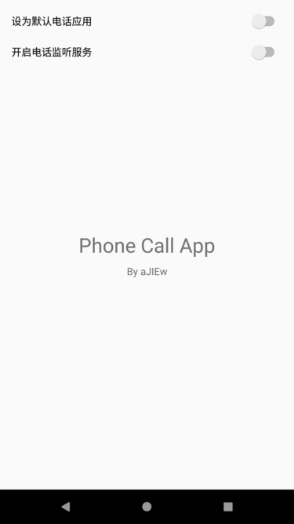
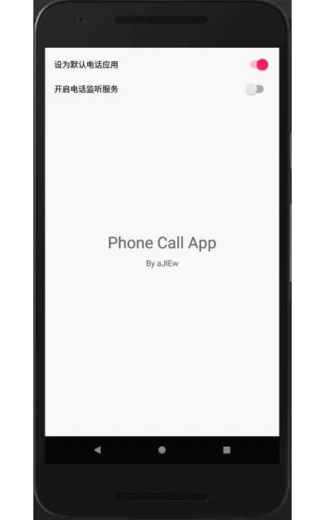
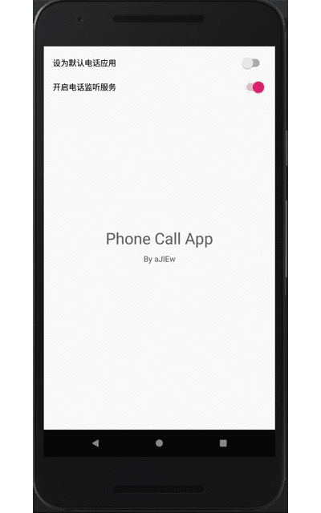

## Phone Call App

This project shows you how to make your app as the default phone call app and manage phone calls (only for 6.0+), it also shows you how to listen phone call states.

### Demo

Set as default phone app（Android 6.0+）：

Listen for incoming calls：

Original link:[Android instead of the default phone application (Android 6.0+) Monitor with phone status](https://ajiew.github.io/2018-08-11-android-replace-default-phone-app-and-listen-phone-calls/)
